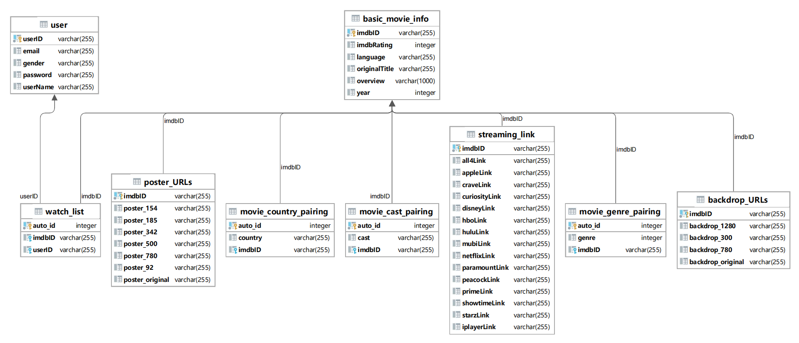
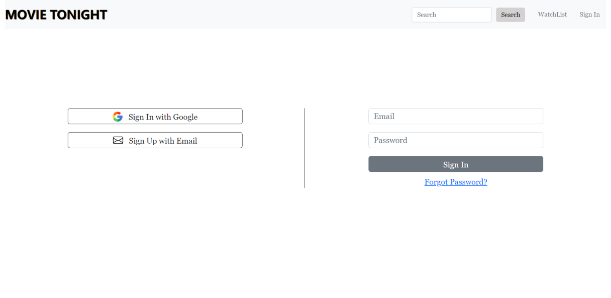
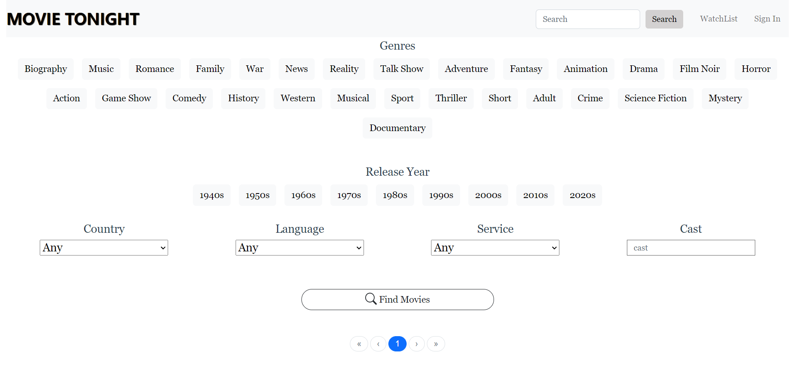
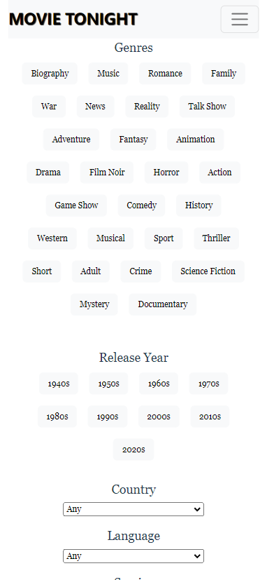
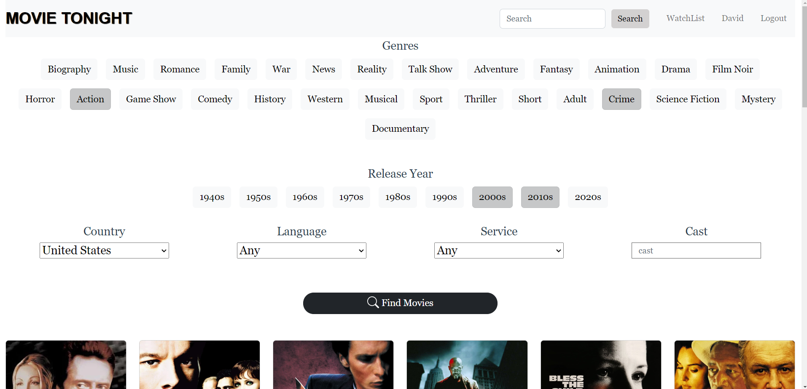
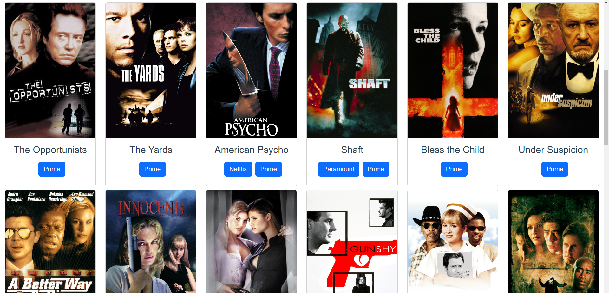

# Movie Streaming Platform in Spring Boot, PostgreSQL and Vue.js #

## Catalog

<a href="#about-project">About The Project</a>

<a href="#data-acquisition-and-processing">Data Acquisition and Processing</a>

<a href="#database-design">Database Design</a>

<a href="#ui-design">UI Design</a>

<a href="#usage">Usage</a>

<a href="#contributing">Contributing</a>

<a href="#contact">Contact</a>

<a href="#acknowledgments">Acknowledgments</a>

<a href="#appendix">Appendix</a>

 

<!-- ABOUT THE PROJECT -->

## About The Project
This project produces a movie searching website which integrates data source from 13 streaming services (Netflix, Prime, Disney+ .etc) with totally 39965 movies. It allow users to search movies through flexible searching criteria and easily find the streaming links of certain services they want.

### Background
Originally, the information of movies is distributed on the internet and different platforms focus on different aspects about movies. This causes some inconvenience for people to find and watch certain movies they want. For example, the Netflix focuses on streaming the video and the Rotten Tomatoes is mainly about recording the acceptance of movies. Moreover, there also exists discrepancy between two platforms of the same type: it’s possible that some movies are contained by Netflix but not by Amazon Prime Video. This causes problems for users because they need to switch between many websites to find what they want. As a consequence, a single monolithic platform including a more complete information of movies on the internet will obviate such an inconvenience and it is appealing to users.

Motivated by such a demand, this project produces a movie search website which integrates resources from tens of different major streaming services such as Netflix, Amazon Prime Video and Disney. The project consists of front-end web pages and a back-end server. The purpose is to provide a compact and time-saving platform with rich resources for movies fans to find movies they want. A very similar and famous website is TMDB [https://www.themoviedb.org/](https://www.themoviedb.org/ "TMDB").

### Built With

1. Vue.js
2. Bootstrap.css
3. Spring Boot
4. PostgreSQL
5. RapidAPI.com

The frontend development is based on Vue.js and Bootstrap and the backend development is based on Spring Boot and PostgreSQL. Data sources of movies is fetched from a public API in RapidAPI.com.

(<a href="#readme-top">back to top</a>)

## Data Acquisition and Processing

Raw data of movies used in the project is provided by a public API at RapidAPI. This API provides complete meta data of a single movie including the streaming link from only one service, which lays the foundation for subsequent more complex data processing.

An example of a set of movie meta data provided by the API is attached in the appendix.

(<a href="#appendix">see appendix</a>)

(<a href="#readme-top">back to top</a>)

## Database Design
Basically, the most straightforward way is to map each Java class into a single table. However, when a database table contains a large number of fields, it can cause several issues such as decreased query performance, increased complexity, and difficulty in managing the table. To address these problems, it is often necessary to partition or shard the table into smaller tables based on a specific set of logic fields. This strategy can help to improve query performance, reduce storage requirements, and simplify data management. Based on this strategy, the ER diagram is designed as shown below.

(<a href="#readme-top">back to top</a>)

## UI Design

#### Login Page

#### Home Page

#### Responsive Design
The interface is intended to be in the responsive style and should fit different sizes of screen. The image below is an example of the interface mode on a cell phone 
 

  

(<a href="#readme-top">back to top</a>)

<!-- USAGE EXAMPLES -->

## Usage

### Use cases:

1. Sign up account
2. Sign in to an existing account
3. Search Movies Based On Specific Criteria
4. Browse movies by page
5. Token Authentication

### Searching Functionality Representation

1. First, click buttons to set searching critiria in terms of genres, years, countries, languages, services and casts.

 
2. Then click on the "Find Movies" button, it will return all movies matching search criteria.

(<a href="#readme-top">back to top</a>)

<!-- CONTRIBUTING -->

## Contributing

Contributions are what make the open source community such an amazing place to learn, inspire, and create. Any contributions you make are **greatly appreciated**.

If you have a suggestion that would make this better, please fork the repo and create a pull request. You can also simply open an issue with the tag "enhancement".
Don't forget to give the project a star! Thanks again!

1. Fork the Project
2. Create your Feature Branch (`git checkout -b feature/AmazingFeature`)
3. Commit your Changes (`git commit -m 'Add some AmazingFeature'`)
4. Push to the Branch (`git push origin feature/AmazingFeature`)
5. Open a Pull Request

(<a href="#readme-top">back to top</a>)

<!-- CONTACT -->

## Contact

Letian Jiang (Email: letian.jiang123@outlook.com)

(<a href="#readme-top">back to top</a>)

<!-- ACKNOWLEDGMENTS -->

## Acknowledgments

The following recourses helped me to complete this project.

* [RapidAPI](https://rapidapi.com/movie-of-the-night-movie-of-the-night-default/api/streaming-availability)
* [Vue.js Documentation](https://vuejs.org/guide/introduction.html)
* [JPA Documentation](https://www.objectdb.com/api/java/jpa)
* [JSON Mapper](https://www.jsonschema2pojo.org/)

(<a href="#readme-top">back to top</a>)

## Appendix

1. Example of Data Provided by API

*{ 
"imdbID":"tt2395427", 
"tmdbID":"99861", 
"imdbRating":73, 
"imdbVoteCount":872847, 
"tmdbRating":72, 
"backdropPath":"/6YwkGolwdOMNpbTOmLjoehlVWs5.jpg", 
"backdropURLs": 
{ 
"1280":"https://image.tmdb.org/t/p/w1280/6YwkGolwdOMNpbTOmLjoehlVWs5.jpg", 
"300":"https://image.tmdb.org/t/p/w300/6YwkGolwdOMNpbTOmLjoehlVWs5.jpg", 
"780":"https://image.tmdb.org/t/p/w780/6YwkGolwdOMNpbTOmLjoehlVWs5.jpg", 
"original":"https://image.tmdb.org/t/p/original/6YwkGolwdOMNpbTOmLjoehlVWs5.jpg" 
}, 
"originalTitle":"Avengers: Age of Ultron", 
"genres":[28,12,878], 
"countries":["US"], 
"year":2015, 
"runtime":141, 
"cast":["Robert Downey Jr.","Chris Hemsworth","Mark Ruffalo","Chris Evans","Scarlett Johansson","Jeremy Renner","James Spader"], 
"significants":["Joss Whedon"], 
"title":"Avengers: Age of Ultron", 
"overview":"When Tony Stark tries to jumpstart a dormant peacekeeping program, things go awry and Earth’s Mightiest Heroes are put to the ultimate test as the fate of the planet hangs in the balance. As the villainous Ultron emerges, it is up to The Avengers to stop him from enacting his terrible plans, and soon uneasy alliances and unexpected action pave the way for an epic and unique global adventure.", 
"tagline":"A New Age Has Come.", 
"video":"JAUoeqvedMo", 
"posterPath":"/4ssDuvEDkSArWEdyBl2X5EHvYKU.jpg", 
"posterURLs": 
{ 
"154":"https://image.tmdb.org/t/p/w154/4ssDuvEDkSArWEdyBl2X5EHvYKU.jpg", 
"185":"https://image.tmdb.org/t/p/w185/4ssDuvEDkSArWEdyBl2X5EHvYKU.jpg", 
"342":"https://image.tmdb.org/t/p/w342/4ssDuvEDkSArWEdyBl2X5EHvYKU.jpg", 
"500":"https://image.tmdb.org/t/p/w500/4ssDuvEDkSArWEdyBl2X5EHvYKU.jpg", 
"780":"https://image.tmdb.org/t/p/w780/4ssDuvEDkSArWEdyBl2X5EHvYKU.jpg", 
"92":"https://image.tmdb.org/t/p/w92/4ssDuvEDkSArWEdyBl2X5EHvYKU.jpg", 
"original":"https://image.tmdb.org/t/p/original/4ssDuvEDkSArWEdyBl2X5EHvYKU.jpg" 
}, 
"age":11, 
"streamingInfo": 
{ 
"disney": 
{ 
"us": 
{ 
"link":"https://www.disneyplus.com/movies/-/76IUxY0rNHzt", 
"added":1606700591, 
"leaving":0 
} 
} 
}, 
"originalLanguage":"en" 
} *

(<a href="#readme-top">back to top</a>)

<!-- MARKDOWN LINKS & IMAGES -->
<!-- https://www.markdownguide.org/basic-syntax/#reference-style-links -->
