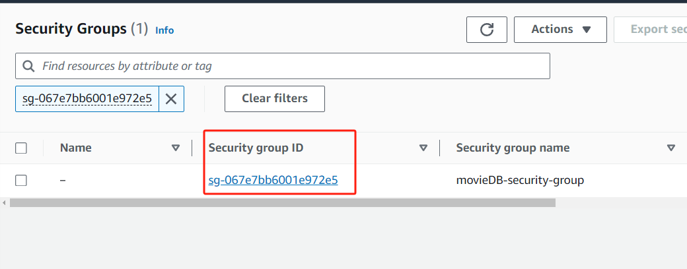

<a name="readme-top"></a>
# Movie Streaming Platform in Spring Boot, PostgreSQL and Vue.js #


## Catalog
<p align="left"><a href="#about-project">About The Project</a></p>
<p align="left"><a href="#data-acquisition-and-processing">Data Acquisition and Processing</a></p>
<p align="left"><a href="#database-design">Database Design</a></p>
<p align="left"><a href="#ui-design">UI Design</a></p>
<p align="left"><a href="#usage">Usage</a></p>
<p align="left"><a href="#deployment">Deployment on AWS</a></p>
<p align="left"><a href="#contributing">Contributing</a></p>
<p align="left"><a href="#contact">Contact</a></p>
<p align="left"><a href="#acknowledgments">Acknowledgments</a></p>
<p align="left"><a href="#appendix">Appendix</a></p>
<br>

Please temporarily use the dummy account below to log into the website: [http://movietonight.s3-website-us-east-1.amazonaws.com](http://movietonight.s3-website-us-east-1.amazonaws.com).<br/> 

username: "david@outlook.com"<br/>
password: "123456"<br/>

Thank you for your interest!

<!-- ABOUT THE PROJECT -->
<a name="about-project"></a>
## About The Project
This project produces a movie searching website which integrates data source from 13 streaming services (Netflix, Prime, Disney+ .etc) with totally 39965 movies. It allow users to search movies through flexible searching criteria and easily find the streaming links of certain services they want.

### Background
Originally, the information of movies is distributed on the internet and different platforms focus on different aspects about movies. This causes some inconvenience for people to find and watch certain movies they want. For example, the Netflix focuses on streaming the video and the Rotten Tomatoes is mainly about recording the acceptance of movies. Moreover, there also exists discrepancy between two platforms of the same type: it’s possible that some movies are contained by Netflix but not by Amazon Prime Video. This causes problems for users because they need to switch between many websites to find what they want. As a consequence, a single monolithic platform including a more complete information of movies on the internet will obviate such an inconvenience and it is appealing to users.

Motivated by such a demand, this project produces a movie search website which integrates resources from tens of different major streaming services such as Netflix, Amazon Prime Video and Disney. The project consists of front-end web pages and a back-end server. The purpose is to provide a compact and time-saving platform with rich resources for movies fans to find movies they want. A very similar and famous website is TMDB [https://www.themoviedb.org/](https://www.themoviedb.org/ "TMDB").

### Built With

1. Vue.js
2. Bootstrap.css
3. Spring Boot
4. PostgreSQL
5. RapidAPI.com

The frontend development is based on Vue.js and Bootstrap and the backend development is based on Spring Boot and PostgreSQL. Data sources of movies is fetched from a public API in RapidAPI.com.


<p align="right">(<a href="#readme-top">back to top</a>)</p>

<a name="data-acquisition-and-processing"></a>
## Data Acquisition and Processing

Raw data of movies used in the project is provided by a public API at RapidAPI. This API provides complete meta data of a single movie including the streaming link from only one service, which lays the foundation for subsequent more complex data processing.

An example of a set of movie meta data provided by the API is attached in the appendix.
<p align="right">(<a href="#appendix">see appendix</a>)</p>


<p align="right">(<a href="#readme-top">back to top</a>)</p>

<a name="database-design"></a>
## Database Design
Basically, the most straightforward way is to map each Java class into a single table. However, when a database table contains a large number of fields, it can cause several issues such as decreased query performance, increased complexity, and difficulty in managing the table. To address these problems, it is often necessary to partition or shard the table into smaller tables based on a specific set of logic fields. This strategy can help to improve query performance, reduce storage requirements, and simplify data management. Based on this strategy, the ER diagram is designed as shown below.


<p align="right">(<a href="#readme-top">back to top</a>)</p>

<a name="ui-design"></a>
## UI Design

#### Login Page


#### Home Page


#### Responsive Design
The interface is intended to be in the responsive style and should fit different sizes of screen. The image below is an example of the interface mode on a cell phone<br>
<br>
<p align="center">
  
</p>

<p align="right">(<a href="#readme-top">back to top</a>)</p>

<!-- USAGE EXAMPLES -->
<a name="usage"></a>
## Usage

### Use cases:

1. Sign up account
2. Sign in to an existing account
3. Search Movies Based On Specific Criteria
4. Browse movies by page
5. Token Authentication

### Searching Functionality Representation

1. First, click buttons to set searching critiria in terms of genres, years, countries, languages, services and casts.

 
2. Then click on the "Find Movies" button, it will return all movies matching search criteria.


<p align="right">(<a href="#readme-top">back to top</a>)</p>

<a name="deployment"></a>
## Deployment

I'm going to deploy my application on AWS Elastic Beanstalk, which will use other AWS service including RDS, EC2 and Route53.

#### 1. Export local database

Use the `pg_dump` tool to export your local PostgreSQL database. This command will generate a SQL script file containing the database structure and data.

Open a command line or terminal and run the following command:

```sh
pg_dump -U <local_username> -W -F c -b -v -f "<output_file_path>" <database_name>
```

- `<local_username>` is your local PostgreSQL database username.
- `<output_file_path>` is the storage path and file name of the export file, such as `/path/to/your/db_backup.dump`.
- `<database_name>` is the name of the database you want to export.

This command will prompt you for the password for your local database.


#### 2. Import to RDS instance

Next, use the `pg_restore` tool to import the exported data into an Amazon RDS instance. You need to be able to connect to the RDS instance from your local machine.

Run the following command to import the data:

```sh
pg_restore -U <rds_username> -h <rds_endpoint> -p 5432 -d <rds_database_name> -v "<input_file_path>"
```

- `<rds_username>` is the username of your RDS instance.
- `<rds_endpoint>` is the end node address of the RDS instance.
- `<rds_database_name>` is the name of the database you created in RDS.
- `<input_file_path>` is the previously exported file path, for example `/path/to/your/db_backup.dump`.

This command will prompt you to enter the password for the RDS instance.

#### 3. Modify application.properties

Change the database source information in `application.properties` file. <br/>
Add the following:<br/>
`spring.datasource.url=jdbc:postgresql://moviedb.cpy4sgyu4vqd.us-east-1.rds.amazonaws.com:5432/postgres`<br/>
`spring.datasource.username=postgres`<br/>
`spring.datasource.password=********`<br/>

Moreover, add `server.port=5000` in the file. This is because the application load balancer by default points to the Port 80 of the nginx server in EC2 instance. The nginx is configured to forward requests to Port 5000 by default, whereas out application server runs on Port 8080.

#### 4. Compile Spring Boot application

Run 'mvn clean package' command to generate a JAR file for the application. This JAR file is generated in `target` folder and will be uploaded to AWS EC2 for my server hosting.

#### 5. Create Application and Environment on AWS Elastic Beanstalk

1) Open Elastic Beanstalk service and click `Create application`.<br/>
2) In the application created, click `Create environment`.<br/>
3) Start configuration, select `web server environment` at first.


4) For the platform, I select `Java`, `Corretto 11 running on 64bit Amazon Linux 2023`. Choose whichever platform and branch that is suitable for your application. This is super important, because inproper branch may lead to failure of the luanch of the application. There's no need to select `Tomcat` or something else for my Spring Boot application in this case, because Spring Boot already configured a Tomcat server in it.\


5) Configure the service access of the environment. If you don't have an IAM instance profile, create one in IAM console.


6) For the following settings in environment config, it's fine to skip everything and leave them at default. Then submit the config and wait for Elastic Beanstalk to launch the environment.


#### 6. Allow your EC2 instance to visit the RDS instance

AWS RDS instance allows visits from permitted security groups. So after my EC2 instance is launched, I need to add the security group of my EC2 instance which is running my environment into the inbound rules of the security group of my RDS instance.<br/>

First, go to my RDS instance. Under "Connectivity & security", click on "VPC security groups".


Then, click on "Security Group ID".



Inside the console of security group, click on "Edit inbound rules". Add rules so that my EC2 instance can visit the RDS instance. In this case I also add a rule allowing me to visit the RDS instance from my local machine for development purpose.


<p align="right">(<a href="#readme-top">back to top</a>)</p>

#### 7. Compile and host Vue.js application

1) First, in the Vue.js application, I need to direct my request to the domain allocated by Elastic Beanstalk for production mode (in this case my server domain is [movienight.us-east-1.elasticbeanstalk.com](movienight.us-east-1.elasticbeanstalk.com)), instead of localhost for dev/test, as I show in the following code:<br/>

`const request = axios.create({`<br/>
`  baseURL: 'http://movienight.us-east-1.elasticbeanstalk.com/api'`<br/>
`  // baseURL: 'http://127.0.0.1:5000/api'`<br/>
`})`

2) Run `npm run build` command in the root folder of my Vue.js application to complie it. This command will generate static files in the `dist` folder. <br/>

3) Open S3 service, create a bucket, set the bucket to "Publicly accessible" by adding the following bucket policy (remember to replace the "bucket-name" with your actual bucket name):<br/>

`{
    "Version": "2012-10-17",
    "Statement": [
        {
            "Sid": "PublicReadGetObject",
            "Effect": "Allow",
            "Principal": "*",
            "Action": "s3:GetObject",
            "Resource": "arn:aws:s3:::bucket-name/*"
        }
    ]
}`

4) Upload the contents in `dist` folder into the S3 bucket.<br/>

5) Click on the "Properties" tab in the bucket console, scroll down to the bottom and find "Static website hosting". Click on "Edit" and configure it as the picture below shows. This will generate an URL for the website. In this case, my url is [http://movietonight.s3-website-us-east-1.amazonaws.com](http://movietonight.s3-website-us-east-1.amazonaws.com).

**Now, click on the url, you should see you application run perfectly!**


#### 8. Trouble Shooting

If you keep getting errors from Elastic Beanstalk in the process of launching the environment, consider the following aspects:<br/>

1. The permission of your RDS instance
2. The compatibility of the platform (e.g. Running Java 11 application in Java 8 platform will lead to failure)
3. Domain and port configuration

If the error message is not available, try to connect to your EC2 instance directly and run the command of lauching the Spring Boot JAR file on that machine: `java -jar /opt/elasticbeanstalk/deployment/app_source_bundle to /var/app/staging/application.jar`. Run the command and see what response you get. Follow the steps shown in pictures below.


<!-- CONTRIBUTING -->
<a name="contributing"></a>
## Contributing

Contributions are what make the open source community such an amazing place to learn, inspire, and create. Any contributions you make are **greatly appreciated**.

If you have a suggestion that would make this better, please fork the repo and create a pull request. You can also simply open an issue with the tag "enhancement".
Don't forget to give the project a star! Thanks again!

1. Fork the Project
2. Create your Feature Branch (`git checkout -b feature/AmazingFeature`)
3. Commit your Changes (`git commit -m 'Add some AmazingFeature'`)
4. Push to the Branch (`git push origin feature/AmazingFeature`)
5. Open a Pull Request

<p align="right">(<a href="#readme-top">back to top</a>)</p>


<!-- CONTACT -->
<a name="contact"></a>
## Contact

Letian Jiang (Email: letian.jiang123@outlook.com)

<p align="right">(<a href="#readme-top">back to top</a>)</p>


<!-- ACKNOWLEDGMENTS -->
<a name="acknowledgments"></a>
## Acknowledgments

The following recourses helped me to complete this project.

* [RapidAPI](https://rapidapi.com/movie-of-the-night-movie-of-the-night-default/api/streaming-availability)
* [Vue.js Documentation](https://vuejs.org/guide/introduction.html)
* [JPA Documentation](https://www.objectdb.com/api/java/jpa)
* [JSON Mapper](https://www.jsonschema2pojo.org/)

<p align="right">(<a href="#readme-top">back to top</a>)</p>

<a name="appendix"></a>
## Appendix

1. Example of Data Provided by API

*{<br>
"imdbID":"tt2395427",<br>
"tmdbID":"99861",<br>
"imdbRating":73,<br>
"imdbVoteCount":872847,<br>
"tmdbRating":72,<br>
"backdropPath":"/6YwkGolwdOMNpbTOmLjoehlVWs5.jpg",<br>
"backdropURLs":<br>
{<br>
"1280":"https://image.tmdb.org/t/p/w1280/6YwkGolwdOMNpbTOmLjoehlVWs5.jpg",<br>
"300":"https://image.tmdb.org/t/p/w300/6YwkGolwdOMNpbTOmLjoehlVWs5.jpg",<br>
"780":"https://image.tmdb.org/t/p/w780/6YwkGolwdOMNpbTOmLjoehlVWs5.jpg",<br>
"original":"https://image.tmdb.org/t/p/original/6YwkGolwdOMNpbTOmLjoehlVWs5.jpg"<br>
},<br>
"originalTitle":"Avengers: Age of Ultron",<br>
"genres":[28,12,878],<br>
"countries":["US"],<br>
"year":2015,<br>
"runtime":141,<br>
"cast":["Robert Downey Jr.","Chris Hemsworth","Mark Ruffalo","Chris Evans","Scarlett Johansson","Jeremy Renner","James Spader"],<br>
"significants":["Joss Whedon"],<br>
"title":"Avengers: Age of Ultron",<br>
"overview":"When Tony Stark tries to jumpstart a dormant peacekeeping program, things go awry and Earth’s Mightiest Heroes are put to the ultimate test as the fate of the planet hangs in the balance. As the villainous Ultron emerges, it is up to The Avengers to stop him from enacting his terrible plans, and soon uneasy alliances and unexpected action pave the way for an epic and unique global adventure.",<br>
"tagline":"A New Age Has Come.",<br>
"video":"JAUoeqvedMo",<br>
"posterPath":"/4ssDuvEDkSArWEdyBl2X5EHvYKU.jpg",<br>
"posterURLs":<br>
{<br>
"154":"https://image.tmdb.org/t/p/w154/4ssDuvEDkSArWEdyBl2X5EHvYKU.jpg",<br>
"185":"https://image.tmdb.org/t/p/w185/4ssDuvEDkSArWEdyBl2X5EHvYKU.jpg",<br>
"342":"https://image.tmdb.org/t/p/w342/4ssDuvEDkSArWEdyBl2X5EHvYKU.jpg",<br>
"500":"https://image.tmdb.org/t/p/w500/4ssDuvEDkSArWEdyBl2X5EHvYKU.jpg",<br>
"780":"https://image.tmdb.org/t/p/w780/4ssDuvEDkSArWEdyBl2X5EHvYKU.jpg",<br>
"92":"https://image.tmdb.org/t/p/w92/4ssDuvEDkSArWEdyBl2X5EHvYKU.jpg",<br>
"original":"https://image.tmdb.org/t/p/original/4ssDuvEDkSArWEdyBl2X5EHvYKU.jpg"<br>
},<br>
"age":11,<br>
"streamingInfo":<br>
{<br>
"disney":<br>
{<br>
"us":<br>
{<br>
"link":"https://www.disneyplus.com/movies/-/76IUxY0rNHzt",<br>
"added":1606700591,<br>
"leaving":0<br>
}<br>
}<br>
},<br>
"originalLanguage":"en"<br>
}<br>*

<p align="right">(<a href="#readme-top">back to top</a>)</p>

<!-- MARKDOWN LINKS & IMAGES -->
<!-- https://www.markdownguide.org/basic-syntax/#reference-style-links -->
